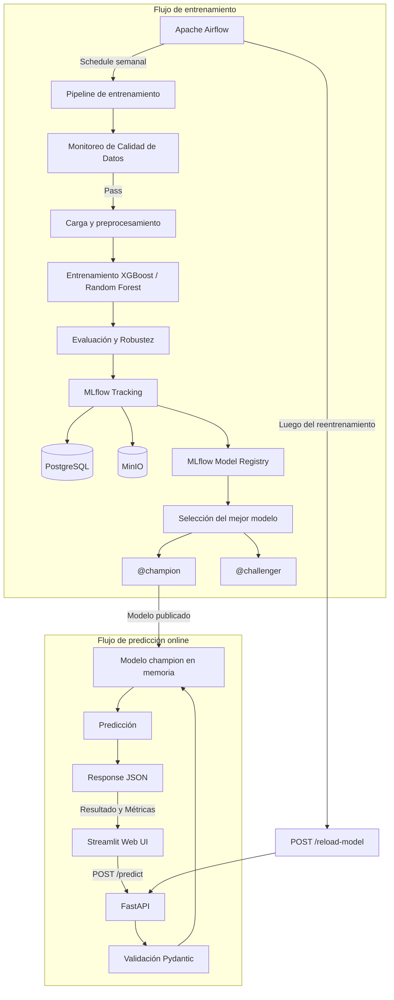

# MLOps – Predicción de satisfacción de pasajeros

## Integrantes

- Belén Della Casa
- Julián Barceló

## Nivel de evaluación

**Nivel en contenedores (nota 8–10)**

Implementación productiva con Docker Compose, Apache Airflow, MLflow, PostgreSQL, MinIO y FastAPI.


## Servicios disponibles
| Servicio | URL | Descripción |
|---|---|---|
| **Streamlit UI** | http://localhost:8501 | Interfaz gráfica interactiva para predicciones web |
| **API REST** | http://localhost:8000 | Predicciones online |
| **API Docs** | http://localhost:8000/docs | Swagger UI |
| **MLflow UI** | http://localhost:5001 | Tracking y Model Registry |
| **Airflow UI** | http://localhost:8080 | Orquestación del reentrenamiento semanal |
| **MinIO Console** | http://localhost:9001 | Almacenamiento S3 interno (credenciales en `.env`) |

## Descripción del proyecto

Este proyecto tiene como objetivo implementar un flujo completo de MLOps a partir del trabajo final realizado en la materia **Aprendizaje de Máquina**.

En el trabajo se desarrollaron modelos de clasificación para predecir la satisfacción de los pasajeros de una aerolínea, utilizando información relacionada con las características del vuelo y el perfil del pasajero.

A partir de los modelos desarrollados, este proyecto busca evolucionar desde una notebook de experimentación hacia una solución reproducible, versionada, automatizada y desplegable mediante contenedores.

La solución utiliza las siguientes tecnologías:

- Docker
- Docker Compose
- MLflow
- MinIO
- PostgreSQL
- FastAPI
- Pydantic
- Apache Airflow
- Scikit-learn
- XGBoost

---

## Objetivo general

Construir una arquitectura MLOps que permita:

- Ejecutar el entrenamiento de los modelos de manera reproducible.
- Automatizar el preprocesamiento de los datos.
- Entrenar y comparar diferentes modelos de clasificación.
- Registrar parámetros, métricas y artefactos en MLflow.
- Versionar los modelos entrenados mediante MLflow Model Registry.
- Almacenar modelos y artefactos en MinIO.
- Persistir los metadatos de los experimentos en PostgreSQL.
- Seleccionar automáticamente el mejor modelo según su ROC AUC.
- Identificar los modelos mediante los alias `champion` y `challenger`.
- Disponibilizar el modelo `champion` mediante una API REST desarrollada con FastAPI.
- Validar las entradas de la API mediante Pydantic.
- Realizar predicciones online en tiempo real.
- Automatizar el reentrenamiento semanal mediante Apache Airflow.
- Recargar automáticamente en la API el nuevo modelo `champion` luego de un reentrenamiento exitoso.
- Ejecutar todos los componentes de la solución mediante Docker Compose.

---

## Arquitectura general

El proyecto separa el flujo de entrenamiento (orquestado por Airflow) del flujo de predicción e incluye una capa interactiva para el usuario (Streamlit).



---

## API

La API fue desarrollada utilizando **FastAPI** y las validaciones de entrada se realizan mediante **Pydantic**.

### Predicción

Endpoint:

```text
POST /predict
```

Ejemplo de request:

```json
{
  "Gender": "Male",
  "Customer Type": "Loyal Customer",
  "Type of Travel": "Business travel",
  "Class": "Business",
  "Age": 41,
  "Flight Distance": 600,
  "Departure Delay in Minutes": 10,
  "Arrival Delay in Minutes": 10
}
```

Ejemplo de response:

```json
{
  "prediction": 1,
  "label": "satisfied",
  "probability": 0.7946587800979614,
  "model_name": "airline_satisfaction_without_scores",
  "model_alias": "champion",
  "model_version": "9"
}
```

### Health check

```text
GET /health
```

### Actualización del modelo

```text
POST /reload-model
```

La API carga en memoria el modelo `champion` al levantar. Este endpoint permite que la API recargue el modelo que actualmente tenga asignado el alias `champion` (Se usa una vez que Airflow termina de reentrenar el modelo).

---

## Automatización del modelo con Airflow

El modelo se reentrena automáticamente de manera semanal.

### Detalles Operativos de Airflow

- **URL de la Interfaz Gráfica (Airflow UI)**: [http://localhost:8080](http://localhost:8080)
- **ID Real del DAG**: `weekly_airline_retraining`
- **Programación (Schedule)**: `59 23 * * 0` (Todos los domingos a las 23:59 hs), además de permitir ejecución manual bajo demanda.

#### Paso a paso para operar el DAG en la interfaz gráfica:

1. **Acceder a la Web UI de Airflow**: Abrir en el navegador [http://localhost:8080](http://localhost:8080).
2. **Localizar el DAG**: En la pantalla principal, buscar en el listado de DAGs por su ID real: `weekly_airline_retraining`.
3. **Activar/Despausar el DAG**: Asegurarse de activar el interruptor (*toggle switch*) ubicado a la izquierda del nombre del DAG para habilitar su ejecución.
4. **Ejecutar manualmente (Trigger DAG)**: Para forzar una ejecución bajo demanda, hacer clic en el botón de reproducción (▶️ **Trigger DAG**) en la esquina superior derecha de la vista del DAG.
5. **Monitorear el progreso**: Ingresar a la vista de *Grid* o *Graph* para visualizar en tiempo real la ejecución secuencial de las tareas:
   - `monitor_raw_data`: Validación de calidad del dataset crudo (*Fail-Fast*).
   - `run_training_pipeline`: Reentrenamiento de los modelos y log de métricas/artefactos en MLflow.
   - `validate_champion`: Verificación de la asignación del alias `champion` en MLflow.
   - `reload_api_model`: Notificación a la API REST (`POST /reload-model`) para recargar en caliente el modelo `champion`.
   - `validate_api`: Comprobación de salud de la API REST (`GET /health`).
6. **Verificar estado final**: Confirmar que todas las tareas se ejecuten exitosamente (estado verde `success`). El modelo `champion` actualizado quedará servido inmediatamente por la API REST sin requerir un reinicio manual de contenedores.

El DAG ejecuta las siguientes tareas:

```text
monitor_raw_data (Validación de calidad)
        ↓
run_training_pipeline (Entrenamiento)
        ↓
validate_champion
        ↓
reload_api_model
        ↓
validate_api
```

Luego de un reentrenamiento exitoso, el nuevo modelo `champion` queda disponible para ser utilizado por la API.

---

## 🛡️ Robustez, Calidad de Datos y Gobernanza

El proyecto implementa prácticas avanzadas de ingeniería MLOps para garantizar la calidad del modelo y los datos en producción:

### 1. Validación de Calidad de Datos (Fail-Fast)
Antes del preprocesamiento, los datos se validan en el DAG de Airflow mediante la tarea `monitor_raw_data` (implementada con un `PythonOperator`). Esta tarea:
*   Valida la integridad del esquema (columnas esperadas).
*   Verifica que el porcentaje de valores nulos no supere un umbral crítico (10%).
*   Aplica lógica de negocio para detectar datos imposibles (edades fuera de rango u horas de retraso negativas).

### 2. Pruebas de Robustez y Fairness
Se ha integrado un set de pruebas de comportamiento antes de promover un modelo a producción (`src/evaluacion/robustness_tests.py`):
*   **Test de Perturbación (Estabilidad)**: Inyecta ruido gaussiano aleatorio en las variables para medir que el modelo no sea errático.
*   **Test de Invarianza (Equidad)**: Valida que el cambio en la variable `Gender` no modifique la predicción de forma discriminatoria (paridad de género).
*   **Expectativas Direccionales**: Verifica que incrementos lógicos (como más horas de retraso) no incrementen absurdamente la probabilidad de satisfacción.

### 3. Explicabilidad Global (SHAP)
Cada auditoría genera e integra un gráfico de importancia de variables global utilizando **SHAP (KernelExplainer)**, el cual queda registrado automáticamente como un artefacto (.png) en la corrida correspondiente en **MLflow UI**.


## Instrucciones de uso

### Configuración de variables de entorno

El archivo `.env` contiene variables de configuración utilizadas por los servicios y no se encuentra versionado en Git por motivos de seguridad.

Luego de clonar el repositorio, crear el archivo `.env` a partir del ejemplo:

```powershell
Copy-Item mlflow_system/.env.example mlflow_system/.env

Para Linux
cp mlflow_system/.env.example mlflow_system/.env
```

Luego se puede levantar el entorno como se indica a continuación.  

### Ingesta de Datos Resiliente y Offline (MinIO)

El pipeline ya no depende de internet (`gdown` en Google Drive) para cada entrenamiento. Se ha implementado un esquema local en MinIO:

1.  **Poblar MinIO**: Ejecuta el script de seeding desde tu computadora host. Este script descargará el dataset original por única vez y lo subirá al almacenamiento S3 interno de MinIO:
    ```bash
    python3 scripts/seed_minio.py
    ```
2.  **Carga Resiliente**: El entrenamiento (`src.pipeline`) priorizará leer de tu caché local (`data/raw/`). Si los archivos no están, los descargará directamente de MinIO usando la red interna rápida de Docker.

### Levantar el proyecto

La primera vez que se ejecuta el proyecto, o cuando se modifican Dockerfiles o dependencias:

```bash
docker compose -f mlflow_system/docker-compose.yml up -d --build
```

Para ejecuciones posteriores, si no hubo cambios en las imágenes:

```bash
docker compose -f mlflow_system/docker-compose.yml up -d
```

> **Importante:** en una instalación nueva, o luego de haber eliminado los volúmenes de Docker, todavía no existe un modelo registrado en MLflow.  
> Por lo tanto, se debe realizar una vez el entrenamiento inicial siguiendo los pasos:

```bash
docker compose -f mlflow_system/docker-compose.yml exec training python -m src.pipeline
```

Una vez finalizado el entrenamiento, reiniciar la API para que cargue el modelo `champion`:

```bash
docker compose -f mlflow_system/docker-compose.yml restart api
```

El proceso de entrenamiento (src.pipeline):

- descarga y prepara los datos;
- entrena los modelos XGBoost y Random Forest;
- evalúa sus métricas;
- registra los modelos en MLflow;
- asigna los aliases `champion` y `challenger`.

Luego se puede validar que la API esté operativa accediendo al endpoint:

```text
GET http://localhost:8000/health
```

No es necesario volver a entrenar el modelo en cada inicio, ya que PostgreSQL y MinIO utilizan volúmenes persistentes de Docker.

### Detener el proyecto

Para detener y eliminar los contenedores:

```bash
docker compose -f mlflow_system/docker-compose.yml down
```

> Los datos persistidos en PostgreSQL, MinIO y Airflow se conservan porque utilizan volúmenes de Docker.

Si se desea reiniciar completamente el entorno y eliminar también los volúmenes:

```bash
docker compose -f mlflow_system/docker-compose.yml down -v
```

> **Importante:** `down -v` elimina los datos persistidos en los volúmenes.  
> Luego de ejecutar este comando será necesario volver a entrenar el modelo siguiendo los pasos de la primera ejecución.

> **Nota:** el build requiere ~10 GB libres. Si la partición raíz está llena, configurar Docker con `"data-root"` en `/home`.

---
