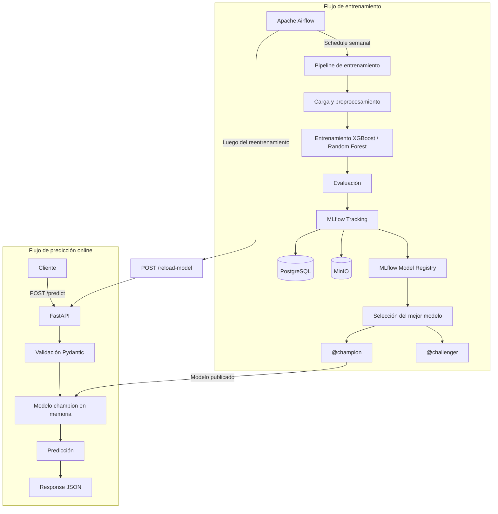

# MLOps – Predicción de satisfacción de pasajeros

## Integrantes

- Belén Della Casa
- Julián Barceló

## Descripción del proyecto

Este proyecto tiene como objetivo implementar un flujo completo de MLOps a partir del trabajo final realizado en la materia **Aprendizaje de Máquina**.

En el trabajo se desarrollaron modelos de clasificación para predecir la satisfacción de los pasajeros de una aerolínea, utilizando información relacionada con las características del vuelo y el perfil del pasajero.

A partir de los modelos desarrollados, este proyecto busca evolucionar desde una notebook de experimentación hacia una solución reproducible, versionada, automatizada y desplegable mediante contenedores.

La solución utiliza las siguientes tecnologías:

- Docker
- Docker Compose
- MLflow
- MinIO
- PostgreSQL
- FastAPI
- Pydantic
- Apache Airflow
- Scikit-learn
- XGBoost

---

## Objetivo general

Construir una arquitectura MLOps que permita:

- Ejecutar el entrenamiento de los modelos de manera reproducible.
- Automatizar el preprocesamiento de los datos.
- Entrenar y comparar diferentes modelos de clasificación.
- Registrar parámetros, métricas y artefactos en MLflow.
- Versionar los modelos entrenados mediante MLflow Model Registry.
- Almacenar modelos y artefactos en MinIO.
- Persistir los metadatos de los experimentos en PostgreSQL.
- Seleccionar automáticamente el mejor modelo según su ROC AUC.
- Identificar los modelos mediante los alias `champion` y `challenger`.
- Disponibilizar el modelo `champion` mediante una API REST desarrollada con FastAPI.
- Validar las entradas de la API mediante Pydantic.
- Realizar predicciones online en tiempo real.
- Automatizar el reentrenamiento semanal mediante Apache Airflow.
- Recargar automáticamente en la API el nuevo modelo `champion` luego de un reentrenamiento exitoso.
- Ejecutar todos los componentes de la solución mediante Docker Compose.

---

## Arquitectura general

El proyecto separa el flujo de entrenamiento del flujo de predicción online.



---

## Instrucciones de uso

### Levantar el proyecto

La primera vez, o cuando se modifican Dockerfiles o dependencias:

```bash
docker compose -f mlflow_system/docker-compose.yml up -d --build
```

Para ejecuciones posteriores, si no hubo cambios en las imágenes:

```bash
docker compose -f mlflow_system/docker-compose.yml up -d
```

### Detener el proyecto

Para detener y eliminar los contenedores:

```bash
docker compose -f mlflow_system/docker-compose.yml down
```

> Los datos persistidos en PostgreSQL, MinIO y Airflow se conservan porque utilizan volúmenes de Docker.

Si se desea reiniciar completamente el entorno y eliminar también los volúmenes:

```bash
docker compose -f mlflow_system/docker-compose.yml down -v
```

> **Importante:** `down -v` elimina los datos persistidos en los volúmenes.

---

## API

La API fue desarrollada utilizando **FastAPI** y las validaciones de entrada se realizan mediante **Pydantic**.

### Predicción

Endpoint:

```text
POST /predict
```

Ejemplo de request:

```json
{
  "Gender": "Male",
  "Customer Type": "Loyal Customer",
  "Type of Travel": "Business travel",
  "Class": "Business",
  "Age": 41,
  "Flight Distance": 600,
  "Departure Delay in Minutes": 10,
  "Arrival Delay in Minutes": 10
}
```

Ejemplo de response:

```json
{
  "prediction": 1,
  "label": "satisfied",
  "probability": 0.7946587800979614,
  "model_name": "airline_satisfaction_without_scores",
  "model_alias": "champion",
  "model_version": "9"
}
```

### Health check

```text
GET /health
```

### Actualización del modelo

```text
POST /reload-model
```

La API carga en memoria el modelo `champion` al levantar. Este endpoint permite que la API recargue el modelo que actualmente tenga asignado el alias `champion` (Se usa una vez que Airflow termina de reentrenar el modelo).

---

## Automatización del modelo con Airflow

El modelo se reentrena automáticamente de manera semanal.

El DAG ejecuta las siguientes tareas:

```text
run_training_pipeline
        ↓
validate_champion
        ↓
reload_api_model
        ↓
validate_api
```

Luego de un reentrenamiento exitoso, el nuevo modelo `champion` queda disponible para ser utilizado por la API.

## Configuración de variables de entorno

El archivo `.env` contiene variables de configuración utilizadas por los servicios y no se encuentra versionado en Git por motivos de seguridad.

Luego de clonar el repositorio, crear el archivo `.env` a partir del ejemplo:

```powershell
Copy-Item mlflow_system/.env.example mlflow_system/.env
```

Luego levantar el entorno:

```powershell
docker compose -f mlflow_system/docker-compose.yml up -d --build
```
